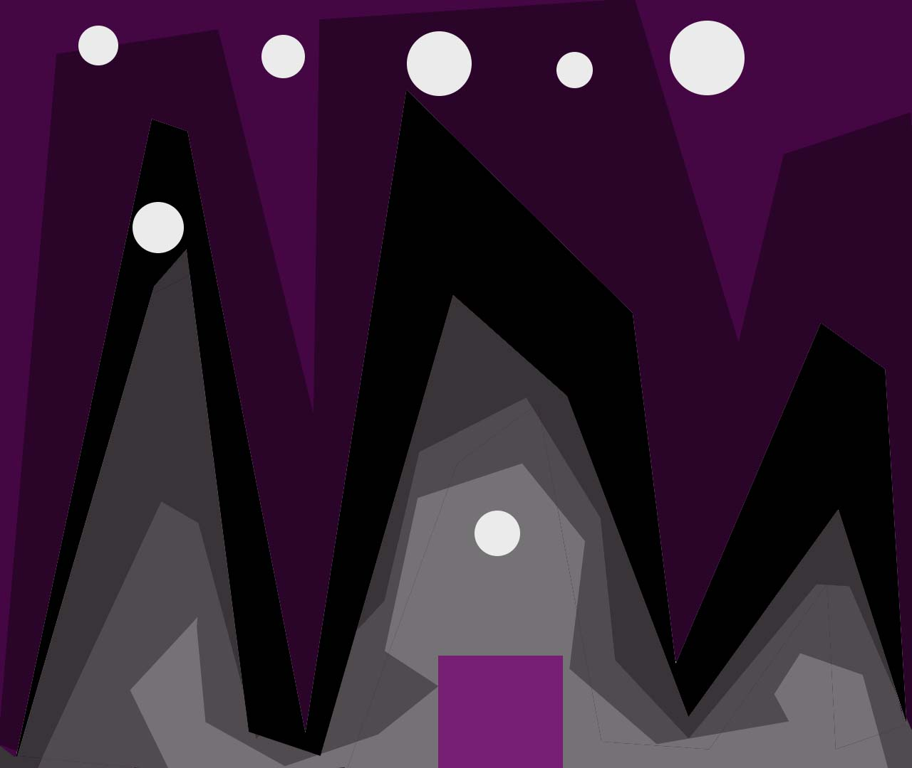
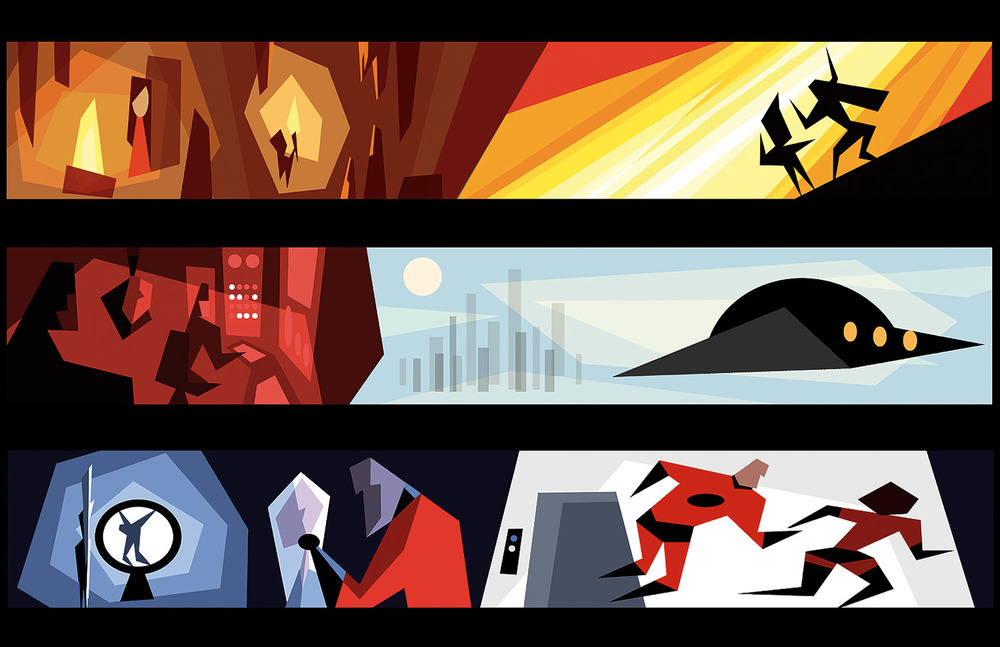
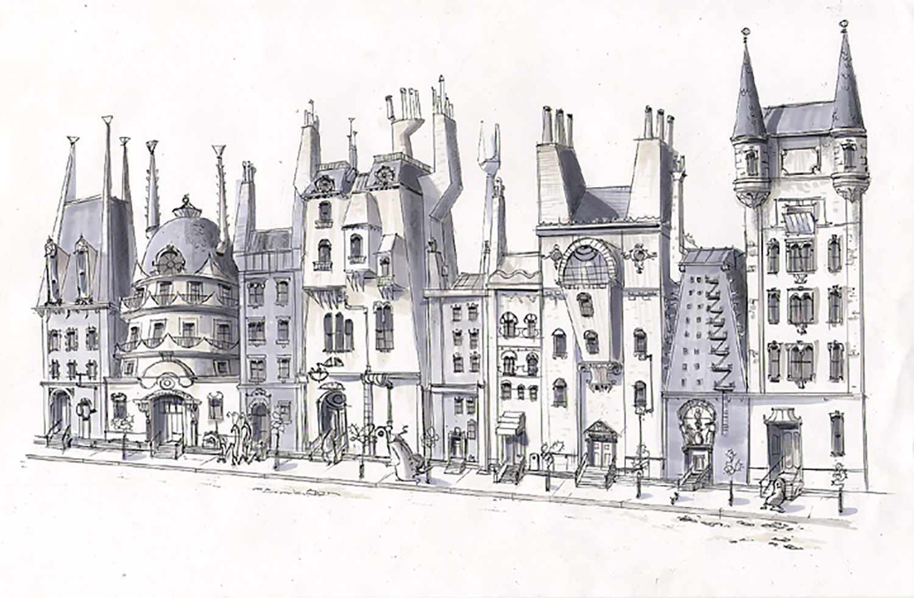

## Final Project
### Simple Game

Completed April 23-27

background design, concept image, some code...

#### Concept

Game... rectangle moves back and forth along the bottom of the window and tries to catch ellipses. Uses keyPressed() to move and keeps the same y variable throughout. Ellipses fall from the top of the screen at random x variables between 0 and windowWidth. I will be using an array for the ellipses that utilizes a random x and a random amount of time before they drop from the top of the screen. When one of these ellipses touches the ground it will disappear. These ellipses also bounce between the side edges before they drop.

The geometric background was created in photoshop and inspired by concept art, specifically some of the concept art for the Pixar films "Monsters Inc." and "The Incredibles".  

I've begun the coding and hope to finish it over the weekend. However, I am having problems bringing in the background. I think its a server problem but I'll have to keep tinkering with it. One problem I know I'll run into is how to control the rectangle "catching" the ellipses. I've been looking around the reference website and found something called keyPressed(). If I can't get that to work the rectangle will follow the mouse. Since we already used that in other projects I think its a good plan b.  
