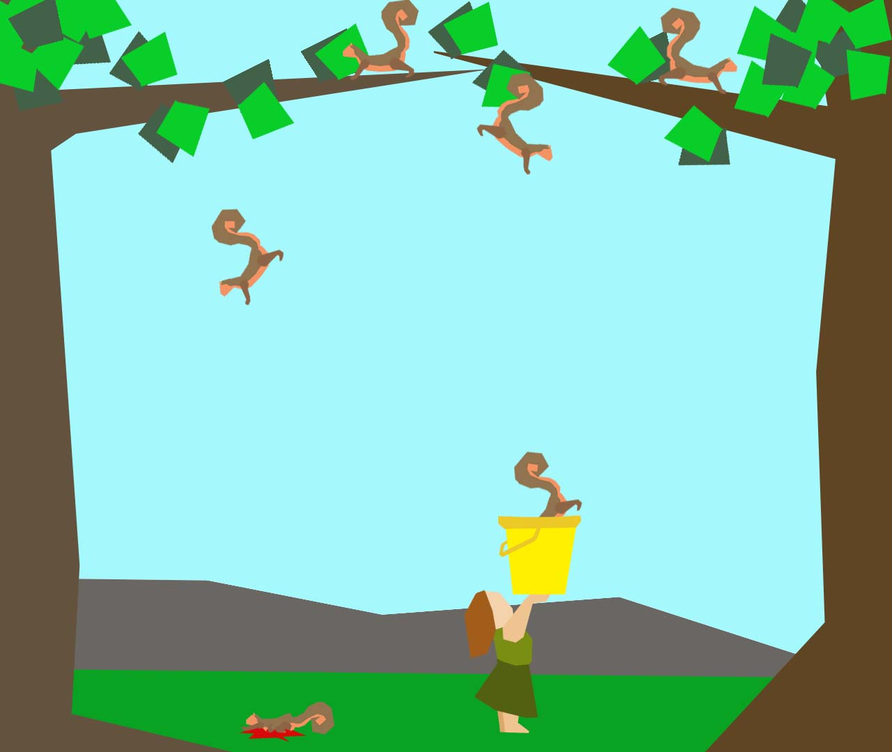

## Final Project
### Simple Game

Completed April 23-27

initial character design, background design, concept image, squirrel sprite sheet, bucket girl sprite sheet

Game... character moves back and forth along the bottom of the window and tries to catch squirrels in a bucket. She uses keyPressed() to move and keeps the same y variable throughout. Hopefully her walking animation will be able to change directions but if that doesn't work she will walk forwards and backwards. Squirrels fall from the top of the screen at random x variables between 0 and windowWidth. I will be using an array for the squirrels that utilizes a random x and a random amount of time before they drop out of the trees. When one of these squirrels touches the ground (windowHeight - something) one of its sprite sheet images will show. The squirrels hopefully will also have a running animation for both directions and a falling animation. All are included in their sprite sheet. Getting that to work might be a bit tricky. If worst comes to worst the squirrels will just show the drop from a random location and disappear when they get to a certain y value. Characters and sprite sheets created in photoshop. If the programing takes a short amount of time, expect kookie kazoo music and start and end menus.

Why squirrels? Why a girl with a yellow bucket? I have no idea.
