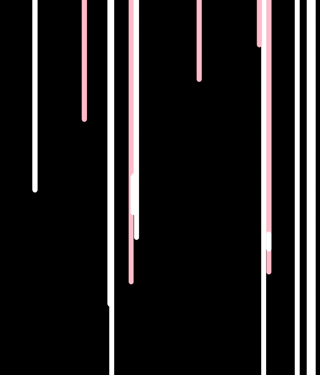

Cecelia Freese

# Final... Drips

### Overview
 So, I had big plans... but I misjudged a few things. Oh well.  

### How the Weeks Went

 My original project was a simple game. I worked on it for two weeks every day, but I kept running into problems. Many of the elements were working. I had a  rectangle that could be moved with the arrow keys and some falling circles, but I could not figure out how to make them interact. After hours each day spent on the internet trying to find a solution, I gave up. I scrapped my game and used some of the things I learned from programming it to create an art piece.

 In my original project contained some circles that fell at different speeds. I wrote a class for these circles, made an array, and wrote a function to move these circles. This function included a variable that produced a random value between 0.5 and 3 that was used for movement.

 I wrote a second function called start_again. This sort of restarts the falling of the circles by returning a y value of 0 when a circle falls below the canvas. This started the circle back at the top and assigned it a different color and falling speed.

 All of these things together creates a drip. I went with simple colors on a black background. It seemed striking at the time.   

 
