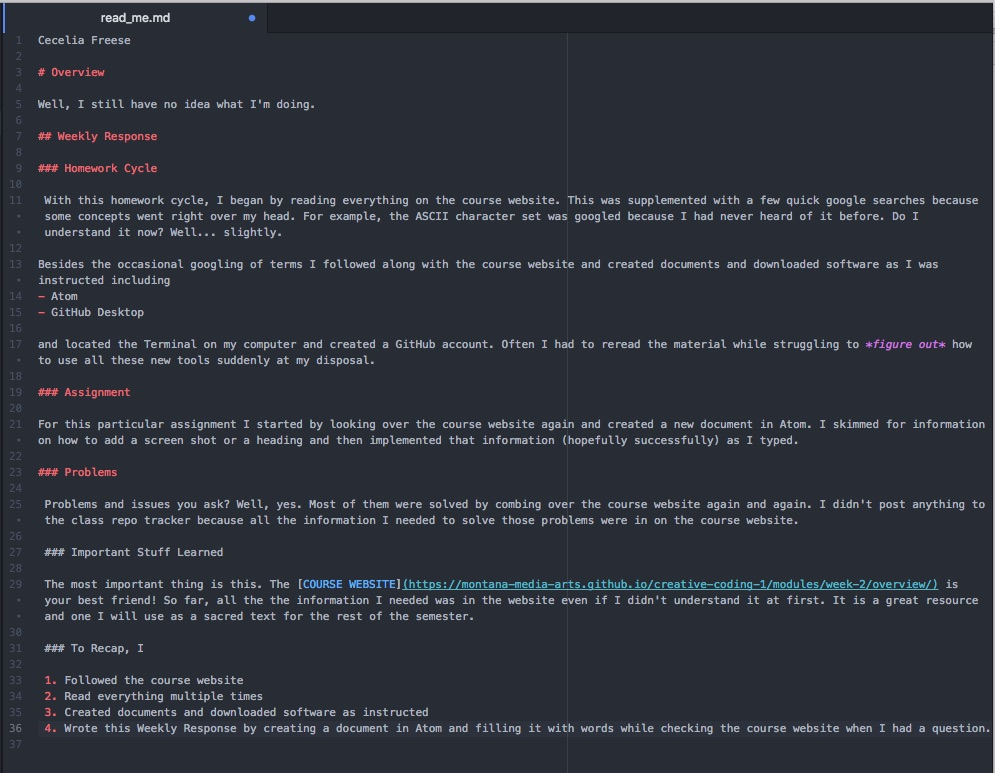

Cecelia Freese

# Overview

Well, I still have no idea what I'm doing.

## Weekly Response  

### Homework Cycle

 With this homework cycle, I began by reading everything on the course website. This was supplemented with a few quick google searches because some concepts went right over my head. For example, the ASCII character set was googled because I had never heard of it before. Do I understand it now? Well... slightly.

Besides the occasional googling of terms I followed along with the course website and created documents and downloaded software as I was instructed including
- Atom
- GitHub Desktop

and located the Terminal on my computer and created a GitHub account. Often I had to reread the material while struggling to *figure out* how to use all these new tools suddenly at my disposal.  

### Assignment

For this particular assignment I started by looking over the course website again and created a new document in Atom. I skimmed for information on how to add a screen shot or a heading and then implemented that information (hopefully successfully) as I typed.

### Problems

 Problems and issues you ask? Well, yes. Most of them were solved by combing over the course website again and again. I didn't post anything to the class repo tracker because all the information I needed to solve those problems were in on the course website.

 ### Important Stuff Learned

 The most important thing is this. The [COURSE WEBSITE](https://montana-media-arts.github.io/creative-coding-1/modules/week-2/overview/) is your best friend! So far, all the the information I needed was in the website even if I didn't understand it at first. It is a great resource and one I will use as a sacred text for the rest of the semester.

 ### To Recap, I

 1. Followed the course website
 2. Read everything multiple times
 3. Created documents and downloaded software as instructed
 4. Wrote this Weekly Response by creating a document in Atom and filling it with words while checking the course website when I had questions.

